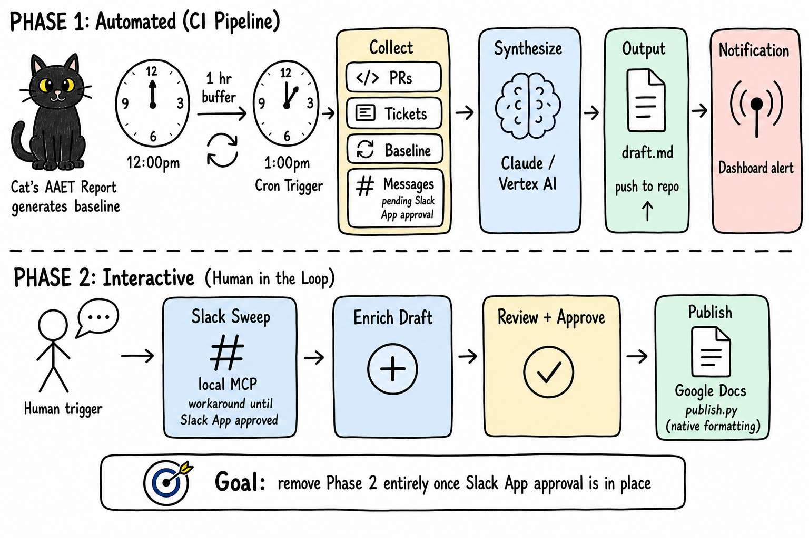
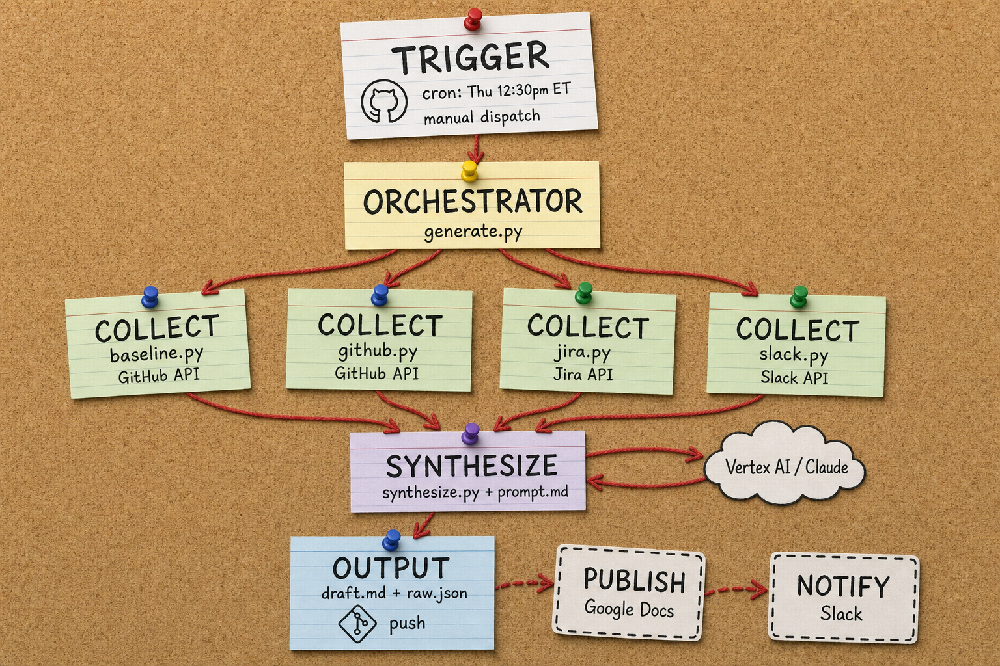

# Weekly Pulse

Generates Data Processing team highlights for the **AAET Weekly Pulse Check**.

A two-phase system: CI generates a draft autonomously every Thursday, then
an interactive review step handles Slack enrichment and Google Docs publishing
with a human in the loop.

The remaining blocker for full autonomy is Slack App approval (for CI-based
message collection).

## How it works



**Phase 1 - Automated (CI Pipeline, every Thursday 12:30pm ET):**

1. **Cron trigger** - GitHub Actions fires 30min after Cat's baseline AAET report
2. **Collect** - pulls from GitHub PRs/reviews, Jira tickets, and the baseline
   report. Slack message collection requires a Slack App with `search:read`
   scope, which is pending internal approval. Skipped gracefully without it.
3. **Synthesize** - Claude (Vertex AI) distills raw data into concise,
   style-matched bullet points with multi-section routing (DATA_PROCESSING,
   RISKS, CUSTOMERS, ASSOCIATES)
4. **Output** - draft committed to repo, Dashboard notification fires

**Phase 2 - Interactive (Argus session, human in the loop):**

Steps 2-5 are orchestrated by the `weekly-pulse-review` Argus skill
(`.cursor/skills/weekly-pulse-review/SKILL.md`), triggered by the phrase
"produce the report."

1. **Human trigger** - user says "produce the report" in an Argus session
2. **Slack sweep** - uses a local MCP tool to search team member messages.
   This is a workaround until the Slack App is approved, at which point
   collection moves into the CI pipeline (Phase 1, step 2).
3. **Enrich** - notable Slack findings are folded into the draft
4. **Review + Approve** - user reviews the final version
5. **Publish** - `publish.py` writes all sections to the live Google Doc
   with native formatting (bullets, hyperlinks, bold removal)

## Architecture



The CI layer is a Python pipeline orchestrated by `generate.py`. GitHub Actions
triggers it on a cron schedule (or manual dispatch). The orchestrator calls
collector modules in sequence, each hitting a different external API. Collected
data flows into `synthesize.py`, which formats it against `prompt.md` templates
and calls Vertex AI (Claude) for final bullet generation. Output is committed
back to the repo and a Dashboard notification fires.

Publishing is handled by `publish.py` (`google-api-python-client`), which
discovers the target doc dynamically from a shared Drive folder, parses the
draft markdown into structured content (UTF-16 offsets, hyperlink ranges,
bullet regions), and writes to Google Docs with native formatting. Slack sweep
runs locally via MCP `search_messages` (browser-authenticated token) during
the interactive review step.

## Quick start

```bash
cp .env.example .env
# Fill in credentials (see table below)

pip install -r requirements.txt
python generate.py --days-back 7
```

## Automated schedule

GitHub Actions runs every Thursday at 12:30pm ET (after Cat's AAET baseline
report generates at noon). Draft is ready for review by ~12:35pm. You can
also trigger the CI manually from the Actions tab.

## Configuration

Edit `config.yaml` to update:

- Team members (names, emails, GitHub usernames)
- GitHub repos to track
- Jira component and projects
- LLM model settings

## Credentials

| Variable | Purpose |
|---|---|
| `GITHUB_TOKEN` | Access to Cat's report repo + team activity |
| `JIRA_USERNAME` | Jira API auth |
| `JIRA_API_TOKEN` | Jira API auth |
| `SLACK_USER_TOKEN` | Slack message search (xoxp token, `search:read` scope) - pending Slack App approval |
| `GCP_CREDENTIALS` | Vertex AI for Claude (JSON service account key) |
| `GOOGLE_DOCS_CREDENTIALS` | Google Docs publish (service account JSON, needs doc shared with SA email) |

## Setup: Google Docs publishing

To enable automated publishing to the Weekly Summary doc:

1. Create a GCP service account (or reuse an existing one)
2. Enable the Google Docs API in the project
3. Share the Weekly Summary doc with the service account email (Editor access)
4. Download the service account JSON key
5. Add it as `GOOGLE_DOCS_CREDENTIALS` secret in GitHub Actions
6. Test with: `GOOGLE_DOCS_CREDENTIALS=path/to/key.json python publish.py --dry-run`

## Automation roadmap

| Blocker | Status | Once resolved |
|---|---|---|
| Slack App (`search:read` scope) | Pending approval | Slack collection moves to CI (Phase 1), Phase 2 disappears |
| ~~Google Docs publisher module~~ | Done (`publish.py`) | ~~Publishing moves to CI~~ |
